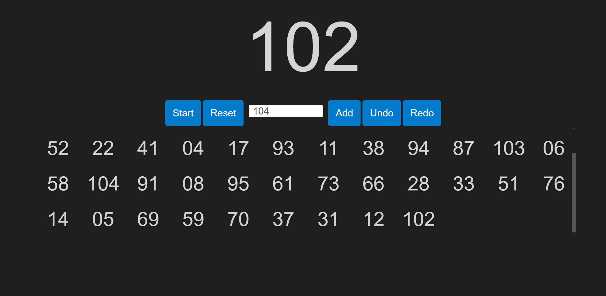

ORC忘年会用のJavaScriptビンゴスクリプトです。  
サンプルは[こちら](http://otake-ko.github.io/ORCBingo/)で動かしてみることができます。

### 使い方
7×7のビンゴ用に、1~110の範囲でビンゴゲームを行います。
zipファイルを解凍後、index.htmlをブラウザで開くことで使うことができます。  
Startボタンを押すとルーレットがスタートし、Stopボタンを押すとルーレットがストップします。  
ドラムロールは3.5秒ほど流れます。  
Startボタンはクリックの他、スペースキーを押しても動作します。
任意の数字を入力してAddを押下するとHistoriesに追加されます。
なお、ルーレットの履歴はローカルストレージに保存しているため、
再読み込みをしても消えません。  
リセットボタンをクリックすることで履歴をクリアします。  

### ダウンロード
[こちらから](https://github.com/sifue/partybingo/archive/gh-pages.zip)

### 動作環境
動作確認は、

- Chrome

でしか行っていません。
なお、このプロジェクトをZipとしてダウンロードしてお使い頂ければ、
インターネット接続は不要です。

### 引用元
[こちら](https://github.com/sifue/partybingo)

